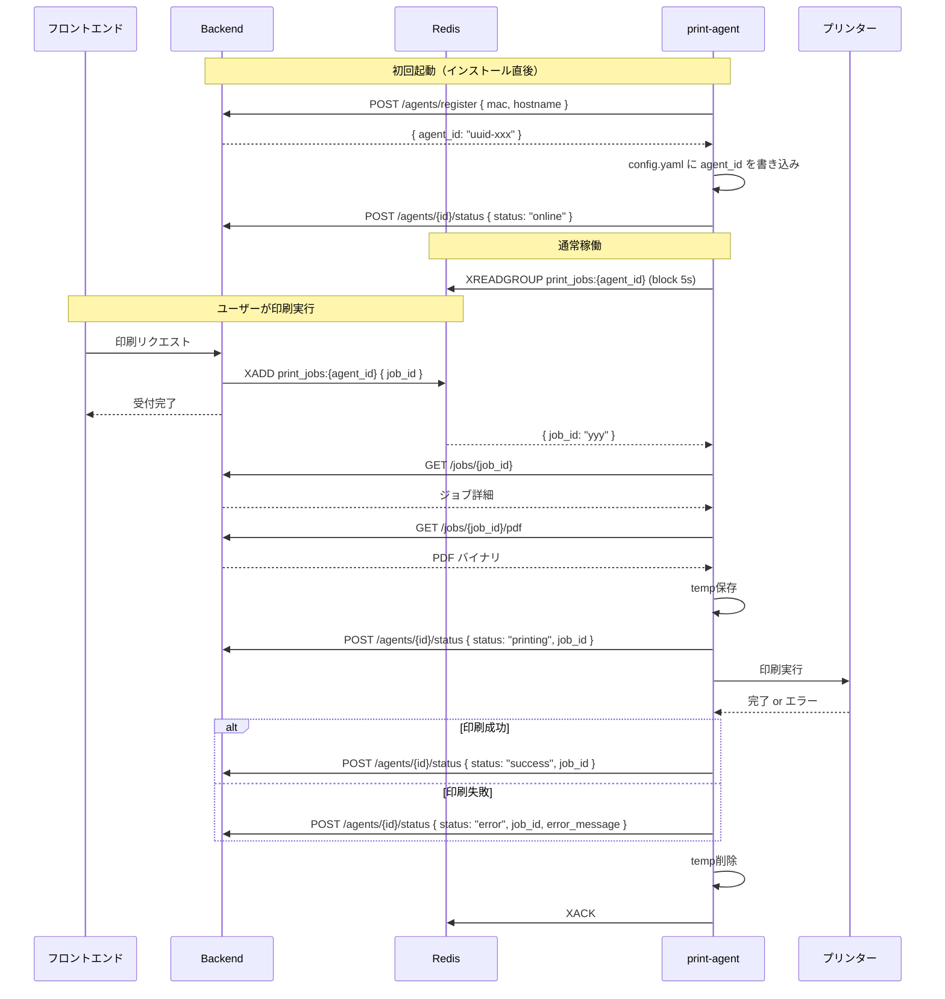

# 処理フロー シーケンス図

```mermaid
sequenceDiagram
    participant FE as フロントエンド
    participant BE as Backend
    participant Redis as Redis
    participant Agent as print-agent
    participant Printer as プリンター

    Note over Agent,BE: 初回起動（インストール直後）
    Agent->>BE: POST /agents/register { mac, hostname }
    BE-->>Agent: { agent_id: "uuid-xxx" }
    Agent->>Agent: config.yaml に agent_id を書き込み
    Agent->>BE: POST /agents/{id}/status { status: "online" }

    Note over Agent,Redis: 通常稼働
    Agent->>Redis: XREADGROUP print_jobs:{agent_id} (block 5s)

    Note over FE,Redis: ユーザーが印刷実行
    FE->>BE: 印刷リクエスト
    BE->>Redis: XADD print_jobs:{agent_id} { job_id }
    BE-->>FE: 受付完了

    Redis-->>Agent: { job_id: "yyy" }
    Agent->>BE: GET /jobs/{job_id}
    BE-->>Agent: ジョブ詳細
    Agent->>BE: GET /jobs/{job_id}/pdf
    BE-->>Agent: PDF バイナリ
    Agent->>Agent: temp保存

    Agent->>BE: POST /agents/{id}/status { status: "printing", job_id }

    Agent->>Printer: 印刷実行
    Printer-->>Agent: 完了 or エラー

    alt 印刷成功
        Agent->>BE: POST /agents/{id}/status { status: "success", job_id }
    else 印刷失敗
        Agent->>BE: POST /agents/{id}/status { status: "error", job_id, error_message }
    end

    Agent->>Agent: temp削除
    Agent->>Redis: XACK
```
